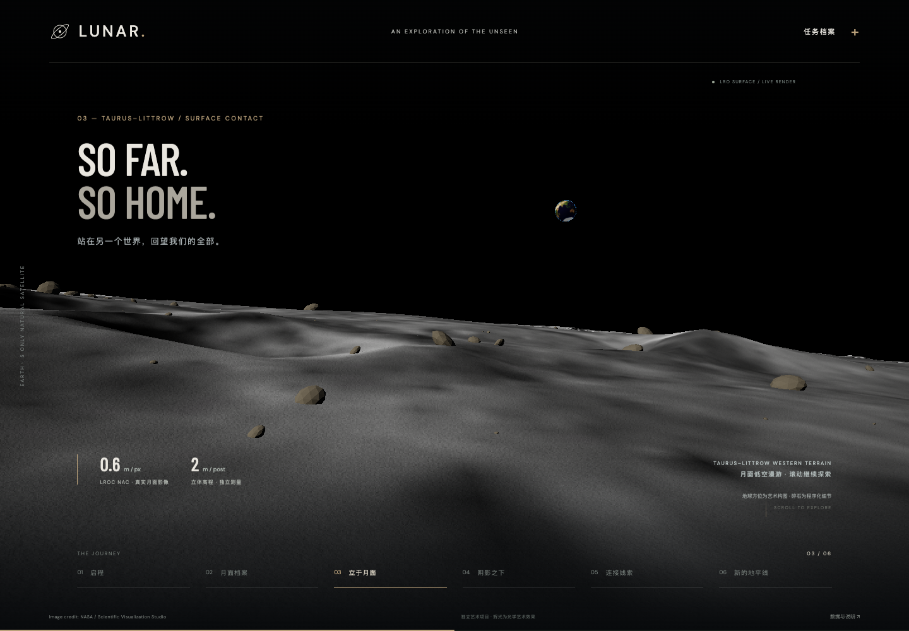

# LUNAR — Beyond the visible

一个独立的月球艺术展示项目，以 NASA LRO 月面数据与 NASA–IBM Lunar Foundation Model 为叙事背景。React + Vite + TypeScript + react-three-fiber + three.js + postprocessing。



## 本地运行

要求 Node.js **22.12 或更高版本**。

```sh
cd /Users/steven/Projects/lunar-fm-website
npm install
npm run dev
```

打开终端输出的本地地址，通常是 http://127.0.0.1:5173/ 。所有纹理和字体均在项目内，无运行时 CDN 依赖。退出开发服务器使用 Ctrl+C。

```sh
npm run build
npm run preview
```

`package.json` 中所有直接依赖均使用精确版本，`package-lock.json` 固定传递依赖。CI 或要求严格按锁文件安装时使用 `npm ci`。

## 六幕与滚动

页面总长 900svh。下表百分比指 `(scrollY / (documentHeight - viewportHeight))`，不是浏览器窗口高度。底部导航可前往各幕，也可用滚轮、触控、方向键、PageDown、Home、End 自由移动；没有 scroll-snap 或滚轮劫持。

| 进度锚点 | 章节 | 画面 |
| --- | --- | --- |
| 0% | 启程 / Beyond the visible | 右侧完整月球、暖白斜照、左侧编辑式大标题 |
| 18% | 月面档案 / Every scar | 相机推进，月面放大，掠射光强化 LOLA 地形细节 |
| 50% | 立于月面 / So far. So home. | 新增 NAC 地表段，2.1 m 眼高回望地球 |
| 68% | 阴影之下 / Into the shadow | 月球移向左侧并倾斜展示南极，光线转冷暗，极区示意覆盖出现 |
| 84% | 连接线索 / Many signals | 镜头拉开，金色经纬网、扫描带与轨道线浮现 |
| 100% | 新的地平线 / A new perspective | 月球回到中央远景，模型链接与重新启程按钮出现 |

中间位置连续插值，相机、目标、月球变换、太阳方向、地形夸张度、数据网格与文案交叉淡入共用一个带帧率无关指数阻尼的滚动进度。支持反向滚动、直接跳转和尺寸变化。减少动态效果偏好下去掉阻尼、动效过渡与颗粒；保留用户主动滚动的场景变化。

## 图形实现

- **真实纹理**：NASA SVS CGI Moon Kit 的 LROC 4K 彩色地图与 LOLA 16-bit unsigned 高程。无机器学习权重，无模型推理。
- **高程**：从 5760×2880 高程重采样到4096×2048，16位值打包到 PNG 的 R/G 通道。shader 解码为 `(R*65280 + G*255)*0.5 - 10000` 米，相对1737.4km基准球。保持无色彩空间处理、线性采样与禁用高程mipmap。
- **自定义月面 shader**：顶点真实位移；高程中心差分构造切线空间法线；弱光学纹理细节；Lommel–Seeliger / Lambert混合反射；太阳方向控制晨昏线；适量冷色环境光。地形做约2–3.4倍艺术夸张。
- **辉光**：外壳shader做12步视线积分，结合指数衰减密度与光照方向，产生薄层、有体积感的光学辉光。月球没有地球式浓密大气，本效果仅为艺术表现，网页已标注。
- **后处理**：HDR渲染，Bloom → ACES Filmic → 颗粒与暗角；渲染器使用 NoToneMapping，ACES只在后处理做一次。
- **性能**：桌面384×192球面分段、手机256×128；DPR上限1.6；确定性星空；每帧修改uniforms/ref，不以React状态逐帧重渲染。3D模块懒加载。轨道纹理约15.65MB；新地表资产约6.7MB、靠近新段才请求；使用真实独立高程而非将彩色图假当高程。
- **可访问性**：原生页面滚动、可聚焦导航、当前章节aria-current、不可见章节inert、键盘可关闭的原生dialog、减少动态效果支持、WebGL失败时静态月面降级。字体本地托管，许可证保留。

## 结构

```text
src/
  App.tsx                 文案、章节、导航、来源档案、错误边界
  timeline.ts             同步DOM与WebGL的滚动导演
  styles.css              桌面/手机版式与交互
  scene/
    LunarScene.tsx        相机、月球、星空、轨道、后处理
    SurfaceJourney.tsx   局部米制地形、瓦片生命周期、独立相机与合成
    shaders.ts            位移、月面光照、法线、体积辉光、数据叠层
  assets/
    lroc-color-4k.webp    NASA彩色纹理
    lola-height-rg.png    NASA 16位高程RG打包纹理
    manifest.json         原始下载URL、文件大小与SHA-256
    SOURCES.md            素材来源与转换说明
    surface/             NAC 瓦片、Float32 高程、Blue Marble、来源清单
    fonts/                本地字体及OFL许可
scripts/prepare-assets.py 可选：重新下载与转换NASA素材
scripts/requirements-assets.txt 可选素材工具的精确版本
tests/journey.spec.ts     WebGL、滚动、导航、手机、降级验证
playwright.config.ts     自动启停生产预览服务器
```

## 验证

```sh
npm test
```

测试使用本机 Google Chrome (`channel: chrome`)，无需下载额外浏览器；在无Chrome机器上安装Chrome，或将配置改为已安装的Playwright Chromium。软件WebGL用于自动化功能验证，不代表真实GPU性能。测试自动启动并关闭4173端口的生产预览，截图写入被git忽略的 `test-results/`。

检查内容包括实际WebGL渲染（不允许偷偷降级）、shader/JS控制台错误、六幕导航、37%中间滚动位置、手机布局、减少动态效果、档案弹窗和NASA署名。本项目未做移动真机GPU性能基准。

完成时验证：`npm install`成功（0 vulnerabilities）、`npm run build`成功、四项Playwright测试全部通过（含地表按需加载、连续高度、回收与重访）。桌面1440×1000与手机390×844逐幕截图已人工检查；截图示例保存在`docs/`。预览服务由测试结束时自动关闭。

## 科学表述与素材

Image credit: NASA / NASA’s Scientific Visualization Studio.

- [NASA SVS CGI Moon Kit](https://svs.gsfc.nasa.gov/4720/)：LROC彩色图、LOLA高程；彩色图为视觉呈现优化，非定量科学产品。
- [NASA–IBM模型集合](https://huggingface.co/collections/nasa-ibm-ai4science/nasa-ibm-lunar-fm-and-downstream-models)
- [技术报告](https://arxiv.org/abs/2609.13283)

这是独立艺术项目，非NASA或IBM官方产品。极区蓝色覆盖、扫描线、经纬网与坐标为艺术示意，不是实测冰、模型预测或实时地理定位。模型的冰潜力任务回归专家潜力图，不能当作已发现冰资源。没有使用、下载或依赖2.4GB机器学习权重。两种NASA纹理均成功获取，没有程序化替代纹理；程序化内容仅为星空、示意覆盖和光学特效。


## 地表段的滚动节奏与资源管理

- **22%**：预取固定飞行走廊资源；不是首屏下载，也不加载机器学习权重。
- **23.5–32%**：轨道镜头推进，29–32% 与独立米制场景作短暂连续合成。
- **29–39%**：从 8.5 km 急速降到 65 m，辨认 NAC 影像中的单个陨石坑与坡面纹理。
- **39–47%**：65 m → 18 m → 2.1 m，相机从俯视抬向地平线。
- **47–56.5%**：地表高光段。地球、山坡与近景碎石同时出现，少量前行继续由滚动驱动。导航第 3 幕直达 50%。
- **56.5–64%**：升空、回到轨道；**65.5%** 后卸载。反向滚动可重新进入。

四块 1024² 有效像素 NAC 瓦片覆盖固定镜头走廊，外圈使用低分辨率影像与约 24 m DEM；不是全球在线瓦片地图。相邻瓦片有 1 px gutter，法线使用统一高程中心差分，内外网格互补以避免叠面；细节区外沿 55 m 混合粗细纹理，避免突兀的清晰度边界。详见 [来源与精度取舍](src/assets/SOURCES.md)。

`SurfaceJourney` 自主管理 fetch / AbortController、ImageBitmap、纹理、几何、材质、实例缓冲与 HDR render target；不使用会永久缓存纹理的 useLoader。退出范围关闭 bitmap、dispose GPU 对象、清除引用。HTTP 缓存可保留压缩下载用于重访，但不会保留已解码 GPU 资源。下载失败保留轨道叙事，不会令整个页面崩溃。

桌面地表贴图 GPU 估算约 37.4 MiB，CPU 主高程约 4 MiB；另有约 27 MB 几何和随视口变化的 HDR 合成缓冲。1440×1000 下合成分辨率上限 1.4 DPR / 约 300 万像素，缓冲约 34 MB；这些是预算估算，非驱动显存实测。手机纹理解码降档至 512²，网格分段减半，合成 DPR 上限 1.15。资源测试使用 renderer 的纹理对象计数验证退出回到预热基线、重访不增长。Three r186 首次使用 PBR 材质会生成一个共享 16×16 RG16F DFG LUT（1024 bytes），因此首次退出比冷启动多一个渲染器内部纹理；测试明确容许这一个已核实的缓存，而不是容许地表纹理泄漏。

新增脚本 `scripts/prepare-surface.py` 从源 GeoTIFF 条带派生资源；其依赖仅用于可选素材重建，正常 npm 安装与运行不需要 Python。未下载 27k 整图：它约 400 m/px 的全球采样远低于局部 0.6 m NAC。近景碎石/微法线是艺术补充，地球方位经过构图调整，不能当作着陆模拟器。

截图：`docs/preview-surface.png`、`docs/preview-descent.png`、`docs/preview-surface-mobile.png`。
