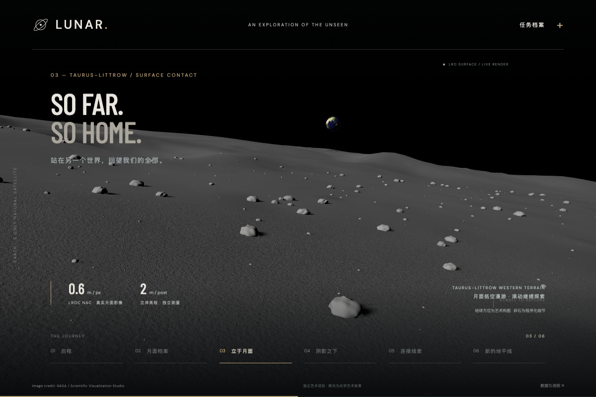

# LUNAR — Beyond the visible

一个独立的月球艺术展示项目，以 NASA LRO 月面数据与 NASA–IBM Lunar Foundation Model 为叙事背景。React + Vite + TypeScript + react-three-fiber + three.js + postprocessing。



## 本地运行

要求 Node.js **22.12 或更高版本**。

```sh
cd /Users/steven/Projects/lunar-fm-website
npm install
npm run dev
```

打开终端输出的本地地址，通常是 http://127.0.0.1:5173/ 。所有纹理和字体均在项目内，无运行时 CDN 依赖。退出开发服务器使用 Ctrl+C。

```sh
npm run build
npm run preview
```

`package.json` 中所有直接依赖均使用精确版本，`package-lock.json` 固定传递依赖。CI 或要求严格按锁文件安装时使用 `npm ci`。

## 六幕与滚动

页面总长 1420svh。中间态新增 160svh 行程；下表为更新后的实际页面滚动位置。百分比指 `(scrollY / (documentHeight - viewportHeight))`，不是浏览器窗口高度。底部导航可前往各幕，也可用滚轮、触控、方向键、PageDown、Home、End 自由移动；没有 scroll-snap 或滚轮劫持。

| 实际滚动进度（内部叙事锚点） | 章节 | 画面 |
| --- | --- | --- |
| 0% | 启程 / Beyond the visible | 右侧完整月球、暖白斜照、左侧编辑式大标题 |
| 39.55%（34.5%） | 月面档案 / Read the land | 20 km 悬停，金色高程走廊框、公里网格与连续扫描 |
| 71.82%（53.5%） | 立于月面 / So far. So home. | 新增 NAC 地表段，2.1 m 眼高回望地球 |
| 80.61%（68%） | 阴影之下 / Into the shadow | 月球移向左侧并倾斜展示南极，连续靠近南极，LOLA 永久阴影区与地形晕渲显现 |
| 90.30%（84%） | 连接线索 / Many signals | 镜头拉开，金色经纬网、扫描带与轨道线浮现 |
| 100% | 新的地平线 / A new perspective | 月球回到中央远景，模型链接与重新启程按钮出现 |

中间位置连续插值，相机、太阳方向、数据网格与文案交叉淡入共用一个带帧率无关指数阻尼的滚动进度。支持反向滚动、直接跳转和尺寸变化。减少动态效果偏好下去掉阻尼、动效过渡与颗粒；保留用户主动滚动的场景变化。

## 图形实现与结构

- 单一米制世界、单一相机、单一可见月面网格，没有局部场景 FBO、第二相机或两个球面的透明叠化。
- `src/scene/geography.ts`：从 GeoTIFF 的投影坐标反算经纬度，半径 1737400 m；LOLA → GLD100 → NAC 共用地理坐标和高程基准，无垂直夸张。非重叠嵌套网格增加近景密度，边缘奇数顶点落在父网格边上。
- `src/scene/flight.ts`：一条连续相机轨迹，对数高度的单调 Hermite 插值；近地面没有位置切换。沿程抬头看地球，再沿同一地理位置升空。
- `src/scene/planetMaterial.ts`：共享太阳方向，PBR 粗糙表面，按空间尺度过滤高程法线，影像高频细节和带限的毫米级程序化微法线。轨道远景降低超出像素尺度的几何法线细节，避免欠采样条纹。
- `src/scene/SurfaceJourney.tsx`：按需加载测量数据、地球与实例化碎石；统一深度缓冲、真实投影阴影。碎石是艺术补充，不能称为测量结果。
- `src/scene/LunarScene.tsx`：渲染与资源生命周期、动态裁剪面、对数深度、4× MSAA、Bloom、ACES、颗粒和暗角。DPR 上限 1.5。月球没有虚构大气壳；地球有薄层辉光。
- `src/timeline.ts`：原生滚动、帧率无关阻尼、DOM 文案与场景进度；支持反向滚动、键盘导航、减少动态效果和 WebGL 降级。
- `src/assets/SOURCES.md`、各 manifest：来源、处理方法、空间精度、SHA-256。

## 验证与逐帧证据

```sh
npm run build
LUNAR_TEST_PORT=4277 npm test
# 单独逐帧复查：先另开终端 npm run preview -- --port 4276 --strictPort
REVIEW_START=14 REVIEW_END=78 node scripts/review-scroll.mjs docs/pace-detail-review/forward 1
REVIEW_START=14 REVIEW_END=78 node scripts/review-scroll.mjs docs/pace-detail-review/reverse 1 --reverse
```

测试使用本机 Chrome 的实际 WebGL（自动化使用 SwiftShader，不代表硬件 GPU 性能）。测试自动启停独立的生产预览；上述命令使用 4277 端口，端口被占用时拒绝复用。

上一轮修复前和修复后均在 1200×800 的真实浏览器中，从 20% 到 66% 每 1% 截图一次。完整序列、相机/高度/资源诊断和错误列表保存在 [逐帧复查](docs/transition-review/index.html)，问题清单见 [复查记录](docs/transition-review/REVIEW.md)。手机布局、导航、弹窗、WebGL 降级、资源释放及重访另由 Playwright 覆盖。

## 科学表述与素材

Image credit: NASA / NASA’s Scientific Visualization Studio.

- [NASA SVS CGI Moon Kit](https://svs.gsfc.nasa.gov/4720/)：LROC彩色图、LOLA高程；彩色图为视觉呈现优化，非定量科学产品。
- [NASA–IBM模型集合](https://huggingface.co/collections/nasa-ibm-ai4science/nasa-ibm-lunar-fm-and-downstream-models)
- [技术报告](https://arxiv.org/abs/2609.13283)

这是独立艺术项目，非NASA或IBM官方产品。极区青蓝区域来自 NASA PGDA / LOLA 推导的永久阴影区（仅面积大于 1 km²），底图为 LOLA 模拟晕渲；不是实测冰或模型预测。配色、边界强调、扫描线、经纬细线为艺术处理。模型的冰潜力任务回归专家潜力图，不能当作已发现冰资源。没有使用、下载或依赖2.4GB机器学习权重。实际地形来自 NASA 数据；碎石、微法线和示意覆盖是明确标注的艺术补充。


## 地表段的滚动节奏与资源管理

下表为内部叙事进度，用于相机曲线；实际浏览器滚动比例见上方六幕表及本轮复查记录。

| 滚动进度 | 观察内容 |
| --- | --- |
| 18–20% | 预取局部数据，轨道中替换为同位置的高精度网格；任意时刻仅一张月面可见 |
| 20–31% | 连续飞向约 20.32° N、30.37° E 的固定位置，31% 高约 80 km |
| 31–39% | 80 km → 9 km → 1 km；GLD100 区域地形逐渐过渡到 NAC 小撞击坑 |
| 39–50% | 1 km → 110 m → 9 m → 2.1 m；俯视连续抬向坡面地平线 |
| 50–56% | 坑缘驻足，看向地球；细小碎石和接触阴影 |
| 56–68% | 连续升空，恢复轨道构图；没有两个球面交叉淡化 |
| 69.5% 之后 / 18% 之前 | 卸载局部资源；反向进入重新加载 |

局部影像覆盖固定走廊，并非全球在线 NAC 瓦片服务。新增 153.6 km 见方的 100 m WAC / GLD100 区域桥接层，四块 NAC 瓦片带 1 px gutter。高程与材质边界在同一地理坐标下平滑融合；全球网格在精细网格区域挖空，避免双层表面。

加载慢时，相机暂留高轨道，资源就绪后连续追上滚动位置；不会跳到空白地面。离开时取消请求、关闭 ImageBitmap、释放纹理/材质/几何/实例和局部阴影贴图，保留浏览器正常 HTTP 缓存。没有额外全屏 HDR 场景合成缓冲。手机 NAC 纹理解码为 512²；地形保持相同的实测高程基准。显存数字是对象与尺寸预算，不是驱动实际显存实测。

重建资源的可选 Python 工具在 `scripts/prepare-global.py`、`prepare-surface.py`、`prepare-regional.py` 和 `prepare-appearance.py`。未下载 27k 全球图或机器学习权重：27k 约 399 m/px，不能替代局部 0.6 m 影像和 2 m 源高程，在轨道视角的实际屏幕像素占幅下也不会比现用的 8k 全局贴图更可见（见下方“全局底图升级”）。影像高频提取只是艺术再光照方法，不是科学反照率反演。

## 历史：节奏与清晰度修复（1c39556）

[完整根因和验证记录](docs/pace-detail-review/REVIEW.md) · [三版逐帧对照 / 正反向播放器](docs/pace-detail-review/index.html)。

该版本只有下降段增加滚动行程：中央区间每单位叙事进度的实际行程为之前的 2.5 倍，入口/出口使用平滑密度过渡，其他幕的像素行程保持原值。实际滚动约 14–65% 为轨道到地表，59–65% 为贴地减速缓冲，65–70% 为地表停留，70–78% 升空。

贴地恢复到 NAC 高精度瓦片内部、接近 04c35f5 的测量区域；继续使用同一个地理世界与相机。保留受限高频影像而不恢复照片大块阴影；缩窄清晰度混合带，恢复带限微法线与颗粒，并让近处地面进入镜头。碎石、微法线仍为艺术补充，原始 0.6 m 影像 / 2 m 源高程精度没有变化。

本轮测试使用独立端口：`LUNAR_TEST_PORT=4277 npm test`。逐帧复查使用自己启动的 `npm run preview -- --port 4276 --strictPort`，不会操作用户的 5173 服务。

## 极区科学制图层

[历史考证与本轮验证](docs/polar-review/REVIEW.md) · [逐帧查看](docs/polar-review/index.html)。原先 `9bb949d` / `04c35f5` 的极区由程序化斑块组成；`2401762` 重构材质时被简化成蓝色纬度极冠。本轮改用 NASA PGDA 产品 90 的 1531 个 PSR 多边形，以及同源 LOLA 晕渲。

当前实际页面约 80.61–83.33% 从全球视角连续靠近南极，83.33–85.15% 观察边界，85.15–90.30% 回到原轨道与下一幕。仍是同一网格 / 相机。月表下降、落点和材质细节不变。详细引用、筛选阈值、显示精度和艺术处理见 `src/assets/SOURCES.md`。

本轮使用生产预览 `npm run preview -- --port 4278 --strictPort`，测试 `LUNAR_TEST_PORT=4280 npm test`，不复用其他端口的服务。

## 中间态：先读地形，再落地

保留六幕，将 02 月面档案挪到内部进度 0.345；03 立于月面直达 0.535。实际 35.45–45% 保持 20 km 高度，扫描随滚动继续推进；45–55.27% 重新下降并收起金色标记，70.91% 达到 2.1 m 眼高。落点、贴地影像/法线/阴影、PSR 数据层保持不变。模拟悬停是叙事相机设计，不是可实现的航天器轨道。

共享月面 shader 按地图米制坐标绘制已载入高程走廊范围（约 4.7×12 km）、1 km 网格、观察落点环与扫描带；不增加网格副本、纹理或帧缓冲。手机中间态使用更宽视场与上方构图。全局轨道线留给后面的全球视角；局部读图使用公里网格，避免把全球经纬网硬放大。

[结构、验证与逐帧报告](docs/survey-review/REVIEW.md) · [全程正反向查看器](docs/survey-review/index.html)。截图文件名为内部叙事百分比，`frames.json` 同时记录实际页面滚动比例。自有预览端口 4291，测试端口 4292。

## 全局底图升级：8K 色彩与 64 ppd 高程真值

此前全球层用 NASA CGI Moon Kit 的 4096×2048 彩色镶嵌，高程则来自套件里 16 像素/度（5760×2880）的栅格再降采样；只有 Taurus–Littrow 落点周边用了 0.6 m 影像与 2 m 高程的局部数据。本轮把全局层也换成该套件公开的更高精度交付版本：

- 彩色贴图改用同一数据集、同一投影的 8192×4096 版本（`lroc_color_poles_8k.tif`），像素数是此前的 4 倍；已用降采样比对确认与原 4k 贴图是同一镶嵌的重新导出（均值差 1.38/255，无旋转或错位）。
- 高程改用该套件 64 像素/度（23040×11520，赤道约 474 m/px）的真实测量栅格，做面积平均（box filter）直接降到运行时使用的同一 4096×2048 网格——交付分辨率不变，但每个像素现在是对真实高分辨率数据的正确降采样，而不是对更粗栅格的插值放大；已核对与套件官方 16 像素/度栅格整体一致（均值偏差约 −0.2 m），且能看出官方栅格本身并非严格面积平均。
- 高程资产格式从 PNG 换成无损 WEBP：体积从 13.18 MB 降到 10.19 MB，同时验证过 Chrome 的 8 位 canvas 回读逐像素与源数据字节一致，不引入色彩管理误差。
- 未采用 27360×13680 全球彩色镶嵌：全局网格的可见多边形密度约每 1° 一环（赤道约 30 km/环），当前 8192×4096（约 1.33 km/px）已经超过该网格能表达的几何细节，27k 在轨道视角下不会带来可见差别，却会把首屏体积推高数倍。
- 只替换全局场景贴图；App 里 WebGL 就绪前的模糊占位圆与 WebGL 失败回退仍用独立的 4096×2048 占位图（同一数据集），不受此次分辨率变化影响，保护最早的首屏渲染。
- 首屏阻塞资源（全局彩色 + 全局高程 + 极区制图层）体积由约 18.8 MB 变为约 21.4 MB；`dist/` 总体积由 31 MB 增至 36 MB。局部 NAC/WAC/地球等资源仍按原有的按需加载机制在滚动到对应区间时才请求，未改变加载时机。
- 重建：`python3 scripts/prepare-global.py`；原始 TIFF（约 580 MB）缓存在仓库外固定目录（默认 `/home/ubuntu/lunar-fm-assets/raw`，可用 `ASSET_CACHE` 环境变量覆盖），已存在则跳过下载，不进入仓库。来源、许可、比对方法与真实性边界见 `src/assets/SOURCES.md`。

[验证记录与逐帧截图](docs/global-upgrade-review/REVIEW.md)。geometry、shader、flight、timeline 均未改动，只替换了两张贴图的数据来源与编码格式。
